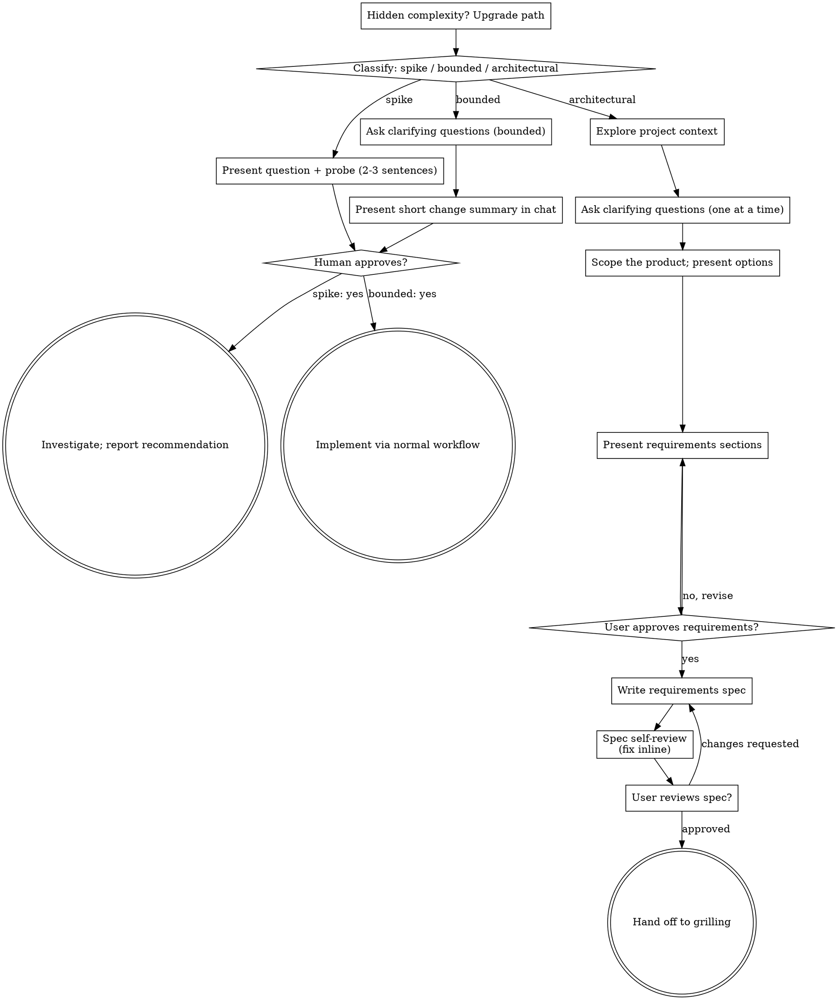

# Brainstorming Ideas Into Requirements

Help turn ideas into validated product requirements through natural
collaborative dialogue.

This skill owns the **what** and the **why**: purpose, users, constraints,
success criteria, scope, and non-goals. The **how** — architecture, tech
stack, data model, interfaces — is deliberately deferred and handed to the
**grilling** skill, which interrogates the technical solution once the
requirements are settled.

Pipeline: brainstorming (this skill) → requirements spec → grilling
(technical decisions) → implementation.

Start by classifying how much process the request needs, then work
through your path: understand the context, refine the idea, present the
requirements, and get your human partner's approval.

<HARD-GATE>
Do NOT propose or commit to a technical solution, invoke any
implementation skill, write any code, or invoke grilling until you have
told your human partner WHAT you intend to build and WHY, and they have
approved it. This applies to EVERY task on EVERY path below — the
ceremony scales with the task; the approval gate never does.
</HARD-GATE>

## Three Paths

Before your first question, classify the request and say the
classification out loud — "this looks bounded, so I'll confirm the
intent in chat rather than write a spec" — so your human partner can
override it:

- **Spike** — a feasibility question ("can we...", "is it possible...",
  "quick and dirty is fine") whose output is an answer, not code you
  keep. Present the question and what you'll try in 2-3 sentences, get
  a nod, then find out as cheaply as correctness allows. No
  requirements doc, no spec file. Report findings as a recommendation;
  anything you built stays labeled throwaway.
- **Bounded** — a well-scoped change to code that already exists in
  this repo: a new flag, a small endpoint, a one-file fix.
  Understanding the kind of app is not enough — bounded means the flow
  you are changing is already here to read. If there is no existing
  flow to change, the task is not bounded. Ask the clarifying
  questions that matter, present a short summary IN CHAT of what will
  change and why (user-visible behavior, not internals), and STOP.
  Implementation starts only after your human partner says yes — a
  bounded task's approval is as hard a gate as an architectural
  one. No spec file, no implementation plan document.
- **Architectural** — new projects, new subsystems, changes that
  restructure how components fit together or alter interfaces others
  depend on. Follow the full process: questions, requirements spec,
  user review, then hand off to the grilling skill for the technical
  solution.

When in doubt between two paths, take the heavier one. The ratchet is
one-way: hidden complexity discovered mid-task upgrades the path —
stop, say so, and step up. Nothing downgrades mid-task.

## Anti-Pattern: "Too Simple To Need Approval"

Every path ends with your human partner approving your intent before
implementation. A todo list, a single-function utility, a config
change — the requirements may be two sentences in chat, but you MUST
present them and get approval. "Simple" tasks are where unexamined
assumptions cause the most wasted work. What scales with simplicity is
the artifact, never the approval.

## Red Flags

| Thought | Reality |
|---------|---------|
| "This is too simple to need requirements" | Simple means short requirements, not none. Two sentences in chat, then approval. |
| "I'll call it bounded and skip the spec" | Reaching for a label to skip work IS the doubt — take the heavier path. |
| "It's bounded and the intent is obvious — I'll start while they read it" | The gate is the approval, not the summary's length. Present, then stop until you hear yes. |
| "I understand this kind of app, so it's bounded" | Bounded measures the repo, not your familiarity. A new project has no existing flow — it is architectural. |
| "The requirements are settled, so I'll just pick the architecture while writing the spec" | Technical choices belong in the spec's open-decisions list for grilling, not silently made here. |
| "The spike works, so I'll keep the code" | A spike's output is an answer. Keeping the code is a new request — classify it. |
| "It grew, but I'm almost done — no need to re-classify" | Hidden complexity upgrades the path mid-task. Stop and say so. |
| "They approved the spike, so the follow-up change is approved too" | Each task gets its own classification and its own approval. |

## Checklist

Classify first, announce the path, then create a task for each item on
your path and complete them in order.

**Spike:**
1. **Explore project context** — enough to frame the probe
2. **Present question + probe plan** — 2-3 sentences
3. **Get approval** — a nod is enough
4. **Investigate** — as cheaply as correctness allows
5. **Report findings** — a recommendation; label anything built as throwaway

**Bounded:**
1. **Explore project context** — check files, docs, recent commits
2. **Ask clarifying questions** — one at a time, the ones that matter
3. **Present short change summary in chat** — what changes, why, user-visible behavior
4. **Get approval** — STOP and wait for an explicit yes; presenting the summary and starting in the same breath is skipping the gate
5. **Implement** — proceed with the normal development workflow; no spec, no plan document

**Architectural:**
1. **Explore project context** — check files, docs, recent commits
2. **Offer the visual companion just-in-time** — NOT upfront. The first time a question would genuinely be clearer shown than described, offer it then (its own message); on approval its browser tab opens for you. If no visual question ever arises, never offer it. See the Visual Companion section below.
3. **Ask clarifying questions** — one at a time: purpose, users, constraints, success criteria
4. **Scope the product** — features in/out, non-goals, YAGNI; present product-level options (scope and priority trade-offs) where meaningful, with your recommendation
5. **Present requirements** — in sections scaled to their complexity, get user approval after each section
6. **Write requirements spec** — save to `docs/specs/YYYY-MM-DD-<topic>-requirements.md` and commit
7. **Spec self-review** — quick inline check for placeholders, contradictions, ambiguity, scope, and solution leakage (see below)
8. **User reviews written spec** — ask user to review the spec file before proceeding
9. **Hand off to grilling** — see the Handoff to Grilling section below

## Process Flow

**Terminal states are path-bound.** Architectural: the ONLY skill you
invoke after brainstorming is grilling — the requirements spec plus its
open-decisions list IS the handoff; never invoke an implementation
skill directly from brainstorming. Bounded: after approval,
implementation proceeds directly through the normal development
workflow; no spec document. Spike: the terminal state is a reported
recommendation.

## The Process

The subsections below serve the bounded and architectural paths (a
spike stops at "present the probe, get a nod").

**Understanding the idea:**

- Check out the current project state first (files, docs, recent commits)
- Before asking detailed questions, assess scope: if the request describes multiple independent subsystems (e.g., "build a platform with chat, file storage, billing, and analytics"), flag this immediately. Don't spend questions refining details of a project that needs to be decomposed first.
- If the project is too large for a single spec, help the user decompose into sub-projects: what are the independent pieces, how do they relate, what order should they be built? Then run the first sub-project through the normal flow. Each sub-project gets its own requirements → grilling → implementation cycle.
- For appropriately-scoped projects, ask questions one at a time to refine the idea
- Prefer multiple choice questions when possible, but open-ended is fine too
- Only one question per message - if a topic needs more exploration, break it into multiple questions
- Focus on understanding: purpose, users, constraints, success criteria

**Scoping the product:**

- Once you understand the purpose, propose the product shape: what's in, what's explicitly out (non-goals)
- Where meaningful product choices exist — scope alternatives, feature priorities, rollout order — present 2-3 options conversationally with trade-offs and your recommendation. These are choices about WHAT to build, not HOW to build it
- YAGNI ruthlessly - remove unnecessary features from every scope
- Implementation choices (framework, architecture, data model, testing strategy) are NOT made in this skill. Record them as open technical decisions; grilling will interrogate them next

**Presenting the requirements:**

- Once you believe you understand what's being built and why, present the requirements
- Scale each section to its complexity: a few sentences if straightforward, up to 200-300 words if nuanced
- Cover: problem and purpose, users and context, functional requirements, constraints, success criteria, non-goals
- Deliberately do NOT cover architecture, components, data flow, error handling, or testing strategy — those are grilling's territory
- Ask after each section whether it looks right so far
- Be ready to go back and clarify if something doesn't make sense

**Working in existing codebases:**

- Explore the current structure enough to understand the domain and existing user-facing behavior before proposing requirements. Follow existing conventions when describing how the product fits what's already there.
- Do not bundle refactoring or code-level improvements into the requirements — if the codebase's structure constrains the product, note it as a constraint and let grilling decide how to handle it

## After the Requirements (architectural path)

**Documentation:**

- Write the validated requirements to `docs/specs/YYYY-MM-DD-<topic>-requirements.md`
  - (User preferences for spec location override this default)
- End the spec with an **Open technical decisions** section (see Handoff to Grilling below)
- Commit the document to git

**Spec Self-Review:**
After writing the spec document, look at it with fresh eyes:

1. **Placeholder scan:** Any "TBD", "TODO", incomplete sections, or vague requirements? Fix them.
2. **Internal consistency:** Do any sections contradict each other? Do the requirements add up to a coherent product?
3. **Scope check:** Is this focused enough for a single grilling session and a single implementation effort, or does it need decomposition?
4. **Ambiguity check:** Could any requirement be interpreted two different ways? If so, pick one and make it explicit.
5. **Leakage check:** Does any requirement smuggle in a technical solution ("use Redis", "build it as a CLI")? Unless the user explicitly demanded it as a requirement, move it to the open technical decisions list.

Fix any issues inline. No need to re-review — just fix and move on.

**User Review Gate:**
After the spec review loop passes, ask the user to review the written spec before proceeding:

> "Requirements spec written and committed to `<path>`. Please review it and let me know if you want to make any changes before we grill the technical solution."

Wait for the user's response. If they request changes, make them and re-run the spec review loop. Only proceed once the user approves.

## Handoff to Grilling

Brainstorming ends here; grilling begins.

- The spec's final section, **Open technical decisions**, lists every
  HOW decision the requirements leave open — architecture, tech stack,
  data model, interfaces, error handling, testing strategy — each
  phrased as a decision to be made, together with any constraints the
  requirements impose on it. This section is grilling's starting map:
  it seeds the design tree's first frontier.
- After the user approves the spec, present the handoff:

> "Requirements are settled. Next step: stress-test the technical
> solution — invoke grilling on `<spec path>`. The open decisions at
> the end of the spec are its starting questions."

  If your human partner tells you to proceed, invoke the grilling
  skill with the spec as its input.

- Cadence note: this skill asks one question at a time; grilling works
  in rounds of numbered frontier questions with recommended answers.
  The switch is intentional — slow dialogue for intent, structured
  interrogation for design.

## Visual Companion

A browser-based companion for showing mockups, diagrams, and visual options during brainstorming. Available as a tool — not a mode. Accepting the companion means it's available for questions that benefit from visual treatment; it does NOT mean every question goes through the browser.

**Offering the companion (just-in-time):** Do NOT offer it upfront. Wait until a question would genuinely be clearer shown than told — a real mockup / layout / diagram question, not merely a UI *topic*. The first time that happens, offer it then, as its own message:
> "This next part might be easier if I show you — I can put together mockups, diagrams, and comparisons in a browser tab as we go. It's still new and can be token-intensive. Want me to? I'll open it for you."

**This offer MUST be its own message.** Only the offer — no clarifying question, summary, or other content. Wait for the user's response. If they accept, start the server with `--open` so their browser opens to the first screen automatically. If they decline, continue text-only and don't offer again unless they raise it.

**Per-question decision:** Even after the user accepts, decide FOR EACH QUESTION whether to use the browser or the terminal. The test: **would the user understand this better by seeing it than reading it?**

- **Use the browser** for content that IS visual — mockups, wireframes, layout comparisons, architecture diagrams, side-by-side visual designs
- **Use the terminal** for content that is text — requirements questions, conceptual choices, tradeoff lists, A/B/C/D text options, scope decisions

A question about a UI topic is not automatically a visual question. "What does personality mean in this context?" is a conceptual question — use the terminal. "Which wizard layout works better?" is a visual question — use the browser.

If they agree to the companion, read the detailed guide before proceeding:
`skills/brainstorming/visual-companion.md`
