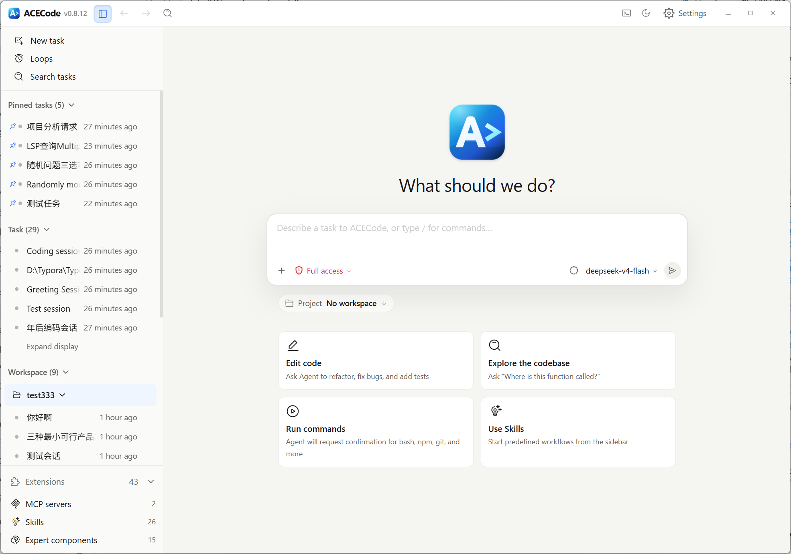
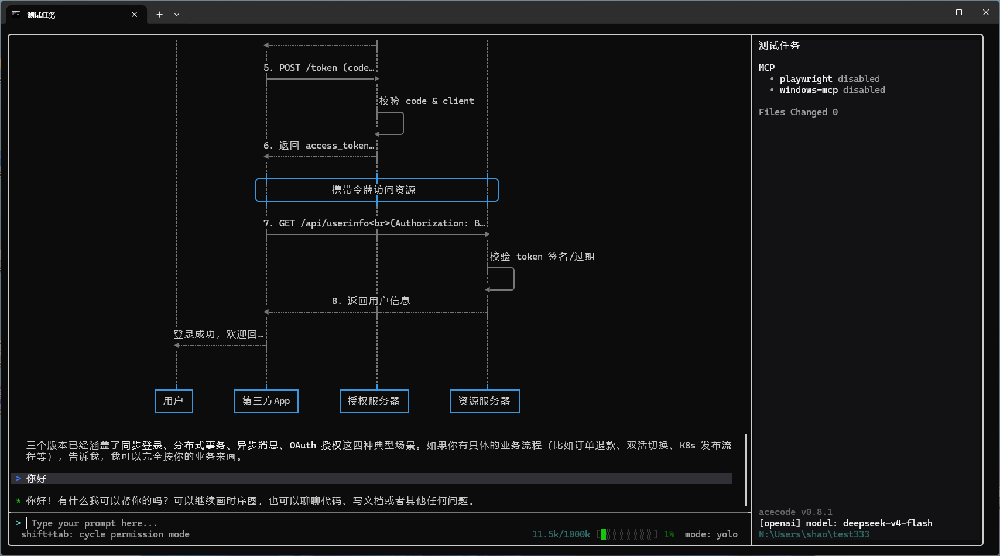

<p align="center">
  
</p>

<h1 align="center">ACECode</h1>

<p align="center">
  <strong>An AI coding agent for your desktop and terminal.</strong><br>
  Understand a codebase, make changes, run commands, and keep development work organized in persistent tasks.
</p>

<p align="center">
  <a href="https://github.com/shaohaozhi286/acecode/stargazers"></a>
  <a href="https://github.com/shaohaozhi286/acecode/network/members"></a>
  <a href="https://github.com/shaohaozhi286/acecode/issues"></a>
  <a href="https://github.com/shaohaozhi286/acecode/commits"></a>
</p>

<p align="center">
  <strong>English</strong> | <a href="README_CN.md">中文</a>
</p>

<p align="center">
  <a href="#see-acecode">Interfaces</a> &bull;
  <a href="#quick-start">Quick start</a> &bull;
  <a href="#core-capabilities">Capabilities</a> &bull;
  <a href="#documentation">Documentation</a>
</p>

ACECode is a repository-aware AI coding agent with two first-class interfaces: a visual Desktop app and a keyboard-first terminal TUI. Both use the same agent core, model profiles, permission system, built-in tools, Skills, and MCP integrations.

## See ACECode

### Desktop

Choose a workspace, start or revisit tasks, select a model and permission mode, attach context, and follow the agent's work from one window.



### Terminal TUI

Work directly from a project terminal with streaming responses, tool progress, session controls, and a focused keyboard-driven interface.



## Quick start

### Desktop

1. Open ACECode Desktop.
2. On first use, open **Settings > Models** and configure a provider and model.
3. Select **New task**, then choose an existing workspace, open a local project, or continue with **No workspace** for a general task.
4. Choose the model and permission mode below the prompt.
5. Describe the result you want and press `Enter`.

> [!TIP]
> Type `@` to reference a workspace file or directory. Use the add button to attach images, files, or folders when extra context is useful.

### Terminal TUI

Configure a model the first time you use ACECode:

```bash
acecode configure
```

Start ACECode from the repository you want it to work in:

```bash
cd /path/to/your/project
acecode
```

Type a concrete request and press `Enter`:

```text
Explore this repository, explain how sessions are stored, then add a focused test for the serializer.
```

Resume the most recent task for the current project when you return:

```bash
acecode --resume
```

> [!IMPORTANT]
> In the default permission mode, ACECode normally reads project context automatically and asks before sensitive writes or command execution. Review permission requests, tool output, and file changes before accepting them.

## Good first requests

- `Explain the architecture and point me to the main entry points.`
- `Find the cause of this failing test and propose a minimal fix.`
- `Refactor @src/session/ without changing its public behavior, then run the focused tests.`
- `Review my current diff for correctness, regressions, and missing tests.`

The best requests name the desired outcome, relevant files or constraints, and how the result should be verified.

## Core capabilities

- **Understand repositories** — search code, follow call paths, inspect configuration, and explain unfamiliar systems.
- **Change code safely** — edit files, show diffs, run commands and tests, and ask for permission when required.
- **Keep context** — persist tasks and sessions, resume earlier work, compact long conversations, and revisit history.
- **Choose your interface** — manage multiple workspaces visually in Desktop or stay close to the shell in the TUI.
- **Use your models** — work with GitHub Copilot, OpenAI-compatible APIs, Anthropic, and saved model profiles.
- **Extend the agent** — add reusable Skills, MCP servers, tools, hooks, and connectors for specialized workflows.

## Useful TUI commands

| Command | Purpose |
| --- | --- |
| `/help` | Show the commands available in the installed version. |
| `/model` | Inspect or switch the current model. |
| `/resume` | Open the session picker. |
| `/skills` | Open the Skills capability center. |
| `/mcp` | Open the MCP server capability center. |
| `/exit` | Leave ACECode. |

## Documentation

- [User manual](docs/user-manual.md) — everyday TUI workflows, permissions, sessions, Skills, and MCP.
- [Architecture](ARCHITECTURE.md) — runtime surfaces and source ownership.
- [Skills guide](docs/skills.md) — create and use reusable workflows.
- [Desktop workspaces](docs/desktop-shell/multi-workspace.md) — workspace and task behavior in the desktop app.
