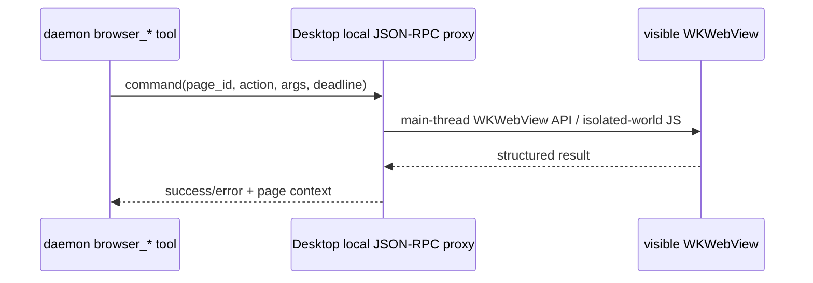

# macOS Agent Browser handoff

## 实施状态（2026-08-02）

本 handoff 的主体方案已经由 OpenSpec change
`add-macos-agent-browser-input-backends` 落地。当前实现只在 macOS 14+ 激活，使用系统
`WKWebView`、identifier data store 和鉴权 `AF_UNIX` socket，不引入 Tauri、Chromium、
CEF、外部浏览器进程或 Safari 私有调试协议。

交互同时提供两套 backend：Agent 默认选择 `synthetic` DOM 事件；遇到站点要求 trusted
event 时可显式选择 `native` CGEvent。native 要求目标页可见/激活和 macOS 辅助功能权限，
权限不足会返回稳定错误，不会静默降级。Windows schema 和 WebView2/CDP 路径保持原样，
Linux 仍不注册 Browser 工具。

已加入真实 `NSWindow`/`WKWebView` smoke，覆盖 page 创建与共享、协议 v4 manifest、同用户
Unix socket、隔离世界 JS、synthetic 文本输入和 viewport PNG 截图。CGEvent 权限提示、
多显示器坐标、Profile 重启登录态、复杂站点以及签名 app 行为仍属于发布前手工验收项。
首版明确接受的折衷还包括：截图仅覆盖 viewport，元素附件支持高亮/单击而非 Windows 的
拖拽共同祖先/closed-shadow 完整选择，跨源 iframe 不保证可操作，Web Inspector 按钮返回
unsupported。

## 目标和不可变合同

macOS 实现复用 Windows 已完成的产品模型：详情栏中可并存多个用户可见 Browser
页签，每个页签有独立页面，用户和 Agent 操作同一目标页，Agent 活动时只有该页显示
彩虹边框。不要重新引入外部 Chrome、
浏览器扩展、`ace-browser-host` 或 shell CLI 提示。

以下上层合同保持不变：

- React bridge 名称：`aceDesktop_agentBrowserCreatePage`、`GetState`、`SelectPage`、
  `ClosePage`、`SetLayout`、`Navigate`、`GoBack`、`GoForward`、`Reload`、`Focus`、
  `Hide`、`SetShared`、`GetConsoleLogs`、`ToggleElementSelection`、
  `ToggleDevTools`。除 Create 外的页面动作都携带 `page_id`。
- state event：`acecode:agent-browser-state`；字段为 `supported`、`ready`、
  `loading`、`visible`、`can_go_back`、`can_go_forward`、`url`、`title`、
  `favicon`、`content_state`、`failure_kind`、`error`、`page_id`、`active`、`closed`、`shared_with_agent`、
  `element_selection_active`、`element_selection_serial`；一次性的
  `selected_element` 只随完成选择的事件发送，不保存在后续 state snapshot 中。
- `content_state` 固定为 `empty`、`loading`、`live`、`navigation_error` 或
  `process_failed`。新页和所有失败状态由共用 React 状态层呈现；native WKWebView 只有
  在 `live` 时才可见，不得显示 WebKit 自带空页、错误页或崩溃页。`failure_kind` 至少
  覆盖网络/证书/超时、OOM、无响应和主页面进程退出的稳定分类。
- 每次 Create 生成 Desktop 生命周期内唯一且稳定的 page id；重复状态事件不得重复
  创建 React 页签。
- 新页默认标题为 `新标签页`；观察每个 WKWebView 的 `title`，按 `page_id` 更新对应
  React 页签。后台页标题变化只更新标题，不能激活或重排页签，空标题回退默认值。
- 每页同时上报经过 scheme/大小校验的 `favicon`。WKWebView 没有稳定公开 favicon
  property 时，在导航完成后通过隔离脚本读取 `link[rel~=icon]`；新导航先清空旧值，
  异步回调必须按 page id 和 generation 拒绝上一文档结果。React 的默认地球回退可直接复用。
- 用户手工创建页默认 `shared_with_agent=false`，Agent proxy 创建页默认 `true`；
  claim/select/close/页面命令必须在 native proxy 再校验，不允许只依赖 React 状态。
- 保持 Windows 的聊天附件合同：元素结果和控制台快照只添加到 composer、可删除且
  不自动发送，并显示在与 Pin/批注相同的 composer 上方引用区；页面加载错误不显示
  网页内红色提示条。
- 工具名、参数和结构化结果沿用 `src/tool/agent_browser/browser_tools.cpp`。
- Profile 必须持久化且与 Safari/普通浏览器隔离；任意网页不得获得
  `aceDesktop_*` binding 或 daemon token。

`web/src/components/AgentBrowserPanel.jsx`、`web/src/lib/agentBrowser.js`、
`web/src/lib/previewTabs.js`、`ChatView.jsx` 和彩虹 CSS 已直接复用。
`hasNativeAgentBrowser()` 已接受 Windows/macOS Desktop 标记并继续校验完整 native
bridge；`src/desktop/main.cpp` 也已为 `__APPLE__` 开启相同 bindings。

## 推荐 native 实现

新增 `src/desktop/agent_browser_host_mac.mm`，让现有
`AgentBrowserHost` public API 保持不变：

1. 从 `WebHost::native_window()` 取得 `NSWindow*`，维护 `page_id -> WKWebView` 管理器；
   每次 Create 在 content view 中创建新的 `WKWebView`，不要复用主 ACECode UI 的
   WKWebView，也不要让多个 React 页签指向同一页面。
2. 用 `WKWebViewConfiguration` 配置独立的 persistent
   `WKWebsiteDataStore`。优先用固定 UUID 调用 `dataStoreForIdentifier:`；把 UUID
   持久化到 `<acecode-dir>/agent-browser/macos-profile-id`，并对较低 deployment
   target 做 availability 检查。Apple 将 identifier data store 定义为 profile
   用的独立持久化 store：
   <https://developer.apple.com/documentation/webkit/wkwebsitedatastore/init(foridentifier:)>
3. 所有页面配置复用同一个隔离 persistent data store，但每页保留独立 history/DOM。
   设置 `WKNavigationDelegate`/`WKUIDelegate`，把 URL、title、loading、历史能力、
   新窗口和 JavaScript dialog 连同 page id 映射到现有 `AgentBrowserState`。
   `target=_blank` 在发起请求的同一个 WKWebView 中加载。保留 WKWebView 的标准网页
   上下文菜单，不要把主 ACECode UI 的右键屏蔽策略带入独立 Browser 页面。
4. `set_bounds` 把 React 传来的物理像素转换为 NSView 坐标。macOS 坐标原点和
   `backingScaleFactor` 与 Windows 不同：先将窗口 client rect 转换到 content view，
   再处理 Y 轴和 backing scale；不要直接照搬 WebView2 的矩形。
5. 只有选中的 Browser 页可以 `hidden = NO`；其它页、窗口隐藏或 ACECode modal
   打开时设置 `hidden = YES`，且还必须满足 `content_state == live`。导航开始即切到
   `loading` 并隐藏 view；导航失败或 Web Content process 终止时映射稳定失败类型，
   保持 view 隐藏。切换时先隐藏旧页再显示新页，关闭页签时解除 delegate、移除 view
   并释放该 WKWebView；只在主线程触碰 AppKit/WebKit。
6. 用一个命名 `WKContentWorld` 执行 snapshot/target-resolution 辅助脚本，避免与网页
   自己的 JS globals 冲突。Apple 明确说明 content world 隔离脚本命名空间，而 DOM
   变化仍对页面可见：
   <https://developer.apple.com/documentation/webkit/wkcontentworld>、
   <https://developer.apple.com/documentation/webkit/wkwebview/callasyncjavascript(_:arguments:in:contentworld:)>
7. 截图使用 `takeSnapshotWithConfiguration`，不要把 WKWebView 画面绕回主 WebView。
8. 元素选择复用 Windows 的 closed-shadow-root 高亮和结果结构，使用命名
   `WKContentWorld` 执行；单击、拖拽共同祖先、`Esc` 取消和点击抑制行为保持一致。
9. 控制台没有 WebView2 Runtime/Log 事件的公开等价 API。可用极小的 page-world
   bootstrap 包装 console 并派发无权限 DOM event，再由命名 content world 转发到
   只接收有界文本的 message handler；不要把有返回值或原生能力的 handler 暴露给网页。
   同样按页保留最近 1000 条、每条 16 KiB，并在新主文档导航时清空。

CMake 已在 Apple 平台启用 Objective-C++。加入 `.mm` 时必须按平台选择唯一实现：
Windows 编译 `agent_browser_host.cpp`，Apple 编译 `agent_browser_host_mac.mm`，Linux
保留单独的 unsupported stub；不要让当前 `.cpp` 内的非 Windows stub 与 `.mm` 同时
定义 `AgentBrowserHost`。Desktop 还要链接 `WebKit` 与 `AppKit` framework，公共 header
保持不变。

## Agent transport：使用 Desktop 代理，不要伪造 CDP

WKWebView 没有 WebView2 的 CDP API，也不能让 Playwright 直接 attach。Windows 首版
已经使用“daemon → 鉴权本地 IPC → Desktop UI 线程 → WebView2 原生 CDP API”的代理
边界；macOS 保持相同边界，只替换 IPC 实现和 WKWebView 命令映射：

- 在 `<acecode-dir>/run/agent-browser.sock` 建 Unix domain socket，权限 `0600`。
  当前跨平台 runtime protocol 已提升到 v4，操作包含 `create_page`、`select_page`、
  `close_page` 和带 `page_id` 的 `cdp`。macOS 增加 transport discriminant 时记录
  `transport: "desktop-jsonrpc"`、socket path、随机 token、Desktop pid/instance id，
  并保持相同页面生命周期语义。不要监听公网或固定 TCP 端口。
- 抽出 `AgentBrowserBackend` 接口，让 `browser_tools.cpp` 保留 schema、结果、超时与
  revision 语义；Windows Desktop 代理调用 WebView2 CDP，macOS Desktop 代理映射到
  WKWebView API/隔离世界脚本。
- Desktop proxy 收到命令后 dispatch 到 main queue；响应必须带 request id，并检查
  deadline/取消。Desktop 重启或 socket 断开时，daemon 重新读取 manifest。
- `browser_read_page`、target resolution、fill 和 evaluate 可以在命名
  `WKContentWorld` 中执行现有 JS 的 macOS 变体；snapshot nodes 不要暴露给 page
  world，也不要注入 `window.webkit.messageHandlers` 给任意网页。

## 必须明确接受或补齐的能力差异

公共 WKWebView API 能导航、执行隔离世界 JavaScript并截图，但没有 CDP
`Input.dispatchMouseEvent`/`Input.dispatchKeyEvent` 的等价公开接口。macOS 首版因此同时
实现下面两种显式边界，不能声称“完全等价”：

- 默认基础版 `synthetic`：`click/fill/type/hover/drag/scroll` 通过 DOM focus、value setter、
  `element.click()` 和合成事件实现。优点是不需要系统权限；缺点是事件
  `isTrusted=false`，部分站点会拒绝。
- 严格真实输入版 `native`：把元素 rect 转成屏幕坐标后使用 CGEvent，涉及辅助功能
  权限、窗口前台和用户鼠标干扰。每次操作都校验目标 Browser 页仍可见且激活；权限不足
  明确返回 `native_input_permission_required`。

不要依赖私有 Safari Remote Inspector protocol；不要把 `isInspectable` 当成可供
daemon attach 的生产 transport。Apple 的公开 WKWebView surface 提供导航、
`evaluateJavaScript`/`callAsyncJavaScript`、`takeSnapshot` 等能力，可从官方 API
清单核对：<https://developer.apple.com/documentation/webkit/wkwebview/>。

Windows 的 Developer Tools 按钮使用 WebView2 `OpenDevToolsWindow`。WKWebView 没有
公开的“打开/切换 Web Inspector”宿主 API；macOS 端不得调用私有 selector。首版应让
`ToggleDevTools` 返回明确的 unsupported 错误，后续只有在 Apple 增加公开 API 时再接入。

## 已落地的实现分层

1. `agent_browser_host_mac.mm` 管理多 WKWebView、布局、可见性、导航、history、dialog、
   popup、console、favicon、元素选择、截图与两套输入 backend。
2. runtime protocol v4 根据平台验证 Windows pipe 或 macOS socket；macOS endpoint 使用
   `0600`、随机 token、同用户 peer 校验、有界帧、deadline 和 UI 主线程 dispatch。
3. 现有 `browser_*` 工具与 revision/page-id 锁定语义继续复用；只有 macOS 交互 schema
   增加 `input_mode`，并在结果中公开 `input_trust`。
4. CMake 只在 Apple 选择 Objective-C++ host 并链接 AppKit、ApplicationServices、
   CoreGraphics、WebKit；Windows 继续选择原 `.cpp`，Linux 保持 unsupported。
5. 自动 smoke 不触发需授权的 CGEvent；发布前按下方清单完成 native/multi-display/
   signed-app 手工验收。

## 验收清单

- [ ] Mac Browser 图标只在 backend `supported=true` 时出现，每次点击都创建新的
  page id/WKWebView/详情页签；同一 page id 的重复事件只对应一个页签。
- [ ] 两页可加载不同 URL 并保留独立 DOM/history；切换只显示目标页，关闭一页不影响
  其它页，关闭全部后没有遗留 WKWebView。
- [ ] 新页标题为“新标签页”，页面 title/favicon 逐页同步且后台更新不抢焦点；缺失或
  失败 favicon 回退地球图标；网页内容区保留 WKWebView 标准右键菜单。
- [ ] 新页显示共用 React Browser welcome 而非 WKWebView 空白页；加载、网络错误、
  OOM/无响应/Web Content process 退出均显示 ACECode 状态层，且 WebKit 内建页面不闪现。
- [ ] 手工地址栏、后退/前进/刷新与 Agent 工具命中同一个 WKWebView 和 history。
- [ ] 逐页共享开关生效；手工页默认不共享、Agent 页默认共享，撤销后 native proxy
  拒绝已有 client 对该页的后续命令。
- [ ] 元素选择结果和有界控制台快照可添加到聊天且不自动发送，并与 Pin/批注显示在同一
  composer 上方引用区；加载失败不出现红色条。
- [ ] `ToggleDevTools` 在没有公开 WebKit API 时返回明确 unsupported，不使用私有 API。
- [ ] Profile 重启后登录保留，Safari Profile 和 ACECode 主 UI storage 不被复用。
- [ ] 任意页面中不存在 `aceDesktop_*`、daemon token 或任意文件读取能力。
- [ ] inactive tab、modal、窗口最小化/隐藏、resize、Retina/非 Retina 屏幕切换不遮挡 UI。
- [ ] `browser_open` 自动创建新页；其它 tool 锁定调用开始时的 page id。只有目标页显示
  彩虹边框，成功、失败、取消、切换任务后可靠清除。
- [ ] socket 仅当前用户可访问，错误 token/pid/instance/protocol 全部拒绝。
- [ ] read/revision/stale ref、截图附件、dialog、popup、超时和 abort 均有自动化测试。
- [ ] 合成输入限制写入用户文档和工具结果；未获辅助功能权限时不偷偷使用 CGEvent。
- [ ] `pnpm test`、`pnpm build`、macOS CMake build/unit tests、签名 app 手工测试通过。
