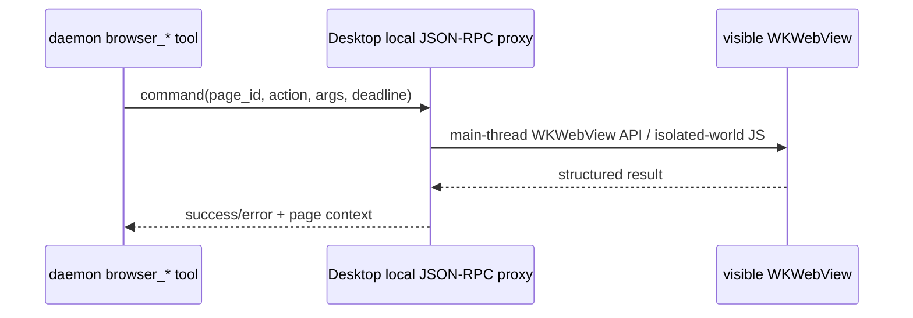

# macOS Agent Browser handoff

## 目标和不可变合同

macOS 后续要复用 Windows 已完成的产品模型：详情栏中可并存多个用户可见 Browser
页签，每个页签有独立页面，用户和 Agent 操作同一目标页，Agent 活动时只有该页显示
彩虹边框。不要重新引入外部 Chrome、
浏览器扩展、`ace-browser-host` 或 shell CLI 提示。

以下上层合同保持不变：

- React bridge 名称：`aceDesktop_agentBrowserCreatePage`、`GetState`、`SelectPage`、
  `ClosePage`、`SetLayout`、`Navigate`、`GoBack`、`GoForward`、`Reload`、`Focus`、
  `Hide`。除 Create 外的页面动作都携带 `page_id`。
- state event：`acecode:agent-browser-state`；字段为 `supported`、`ready`、
  `loading`、`visible`、`can_go_back`、`can_go_forward`、`url`、`title`、
  `error`、`page_id`、`active`、`closed`。
- 每次 Create 生成 Desktop 生命周期内唯一且稳定的 page id；重复状态事件不得重复
  创建 React 页签。
- 工具名、参数和结构化结果沿用 `src/tool/agent_browser/browser_tools.cpp`。
- Profile 必须持久化且与 Safari/普通浏览器隔离；任意网页不得获得
  `aceDesktop_*` binding 或 daemon token。

`web/src/components/AgentBrowserPanel.jsx`、`web/src/lib/agentBrowser.js`、
`web/src/lib/previewTabs.js`、`ChatView.jsx` 和彩虹 CSS 可以直接复用。当前
`hasNativeAgentBrowser()` 当前同时检查 Windows Desktop 标记和完整 native bridge；
macOS backend 完成后，要把 OS gate 扩展到 macOS，并在 `src/desktop/main.cpp` 为
`__APPLE__` 开启这些 bindings，不能只添加 bindings 而忘记入口 gate。

## 推荐 native 实现

新增 `src/desktop/agent_browser_host_mac.mm`，让现有
`AgentBrowserHost` public API 保持不变：

1. 从 `WebHost::native_window()` 取得 `NSWindow*`，维护 `page_id -> WKWebView` 管理器；
   每次 Create 在 content view 中创建新的 `WKWebView`，不要复用主 ACECode UI 的
   WKWebView，也不要让多个 React 页签指向同一页面。
2. 用 `WKWebViewConfiguration` 配置独立的 persistent
   `WKWebsiteDataStore`。优先用固定 UUID 调用 `dataStoreForIdentifier:`；把 UUID
   持久化到 `<acecode-dir>/agent-browser/macos-profile-id`，并对较低 deployment
   target 做 availability 检查。Apple 将 identifier data store 定义为 profile
   用的独立持久化 store：
   <https://developer.apple.com/documentation/webkit/wkwebsitedatastore/init(foridentifier:)>
3. 所有页面配置复用同一个隔离 persistent data store，但每页保留独立 history/DOM。
   设置 `WKNavigationDelegate`/`WKUIDelegate`，把 URL、title、loading、历史能力、
   新窗口和 JavaScript dialog 连同 page id 映射到现有 `AgentBrowserState`。
   `target=_blank` 在发起请求的同一个 WKWebView 中加载。
4. `set_bounds` 把 React 传来的物理像素转换为 NSView 坐标。macOS 坐标原点和
   `backingScaleFactor` 与 Windows 不同：先将窗口 client rect 转换到 content view，
   再处理 Y 轴和 backing scale；不要直接照搬 WebView2 的矩形。
5. 只有选中的 Browser 页可以 `hidden = NO`；其它页、窗口隐藏或 ACECode modal
   打开时设置 `hidden = YES`。切换时先隐藏旧页再显示新页，关闭页签时解除 delegate、
   移除 view 并释放该 WKWebView；只在主线程触碰 AppKit/WebKit。
6. 用一个命名 `WKContentWorld` 执行 snapshot/target-resolution 辅助脚本，避免与网页
   自己的 JS globals 冲突。Apple 明确说明 content world 隔离脚本命名空间，而 DOM
   变化仍对页面可见：
   <https://developer.apple.com/documentation/webkit/wkcontentworld>、
   <https://developer.apple.com/documentation/webkit/wkwebview/callasyncjavascript(_:arguments:in:contentworld:)>
7. 截图使用 `takeSnapshotWithConfiguration`，不要把 WKWebView 画面绕回主 WebView。

CMake 已在 Apple 平台启用 Objective-C++。加入 `.mm` 时必须按平台选择唯一实现：
Windows 编译 `agent_browser_host.cpp`，Apple 编译 `agent_browser_host_mac.mm`，Linux
保留单独的 unsupported stub；不要让当前 `.cpp` 内的非 Windows stub 与 `.mm` 同时
定义 `AgentBrowserHost`。Desktop 还要链接 `WebKit` 与 `AppKit` framework，公共 header
保持不变。

## Agent transport：使用 Desktop 代理，不要伪造 CDP

WKWebView 没有 WebView2 的 CDP API，也不能让 Playwright 直接 attach。Windows 首版
已经使用“daemon → 鉴权本地 IPC → Desktop UI 线程 → WebView2 原生 CDP API”的代理
边界；macOS 保持相同边界，只替换 IPC 实现和 WKWebView 命令映射：

- 在 `<acecode-dir>/run/agent-browser.sock` 建 Unix domain socket，权限 `0600`。
  当前 Windows runtime protocol 已是 v3，操作包含 `create_page`、`select_page`、
  `close_page` 和带 `page_id` 的 `cdp`。macOS 增加 transport discriminant 时记录
  `transport: "desktop-jsonrpc"`、socket path、随机 token、Desktop pid/instance id，
  并保持相同页面生命周期语义。不要监听公网或固定 TCP 端口。
- 抽出 `AgentBrowserBackend` 接口，让 `browser_tools.cpp` 保留 schema、结果、超时与
  revision 语义；Windows Desktop 代理调用 WebView2 CDP，macOS Desktop 代理映射到
  WKWebView API/隔离世界脚本。
- Desktop proxy 收到命令后 dispatch 到 main queue；响应必须带 request id，并检查
  deadline/取消。Desktop 重启或 socket 断开时，daemon 重新读取 manifest。
- `browser_read_page`、target resolution、fill 和 evaluate 可以在命名
  `WKContentWorld` 中执行现有 JS 的 macOS 变体；snapshot nodes 不要暴露给 page
  world，也不要注入 `window.webkit.messageHandlers` 给任意网页。

## 必须明确接受或补齐的能力差异

公共 WKWebView API 能导航、执行隔离世界 JavaScript并截图，但没有 CDP
`Input.dispatchMouseEvent`/`Input.dispatchKeyEvent` 的等价公开接口。因而 macOS 首版
要在下面两种边界中明确选择，不能声称“完全等价”：

- 推荐基础版：`click/fill/type/hover/drag/scroll` 通过 DOM focus、value setter、
  `element.click()` 和合成事件实现。优点是不需要系统权限；缺点是事件
  `isTrusted=false`，部分站点会拒绝。
- 严格真实输入版：把元素 rect 转成屏幕坐标后使用 CGEvent，但这通常涉及辅助功能
  权限、窗口前台和用户鼠标干扰。只有产品明确接受权限提示后再做，并为每次操作
  校验目标窗口仍是 ACECode。

不要依赖私有 Safari Remote Inspector protocol；不要把 `isInspectable` 当成可供
daemon attach 的生产 transport。Apple 的公开 WKWebView surface 提供导航、
`evaluateJavaScript`/`callAsyncJavaScript`、`takeSnapshot` 等能力，可从官方 API
清单核对：<https://developer.apple.com/documentation/webkit/wkwebview/>。

## 建议实施顺序

1. 在 macOS 先实现多 WKWebView create/select/close/layout/show/hide/navigation/state，
   验证连续点击产生独立页、逐页历史、关闭释放、resize、全屏和 Profile 重启保留。
2. 加 Unix socket manifest v3 与一个双页 `create -> navigate -> read -> close` 往返
   测试；保持 Windows 已有的鉴权、owner 校验、page-id 锁定、deadline 和错误语义。
3. 抽 transport 接口并在 macOS 注册现有工具集合；先完成 open/navigate/read/wait/
   screenshot/evaluate/close。
4. 加 DOM interaction backend，并把 `input_trust: "synthetic"` 放进 macOS 动作结果，
   让调用者能看到能力差异。
5. 实现 dialog、popup 同页处理、取消/超时、断线重连和 stale revision。
6. 最后才评估 CGEvent trusted-input 增强；不要让它阻塞可见同页闭环。

## 验收清单

- [ ] Mac Browser 图标只在 backend `supported=true` 时出现，每次点击都创建新的
  page id/WKWebView/详情页签；同一 page id 的重复事件只对应一个页签。
- [ ] 两页可加载不同 URL 并保留独立 DOM/history；切换只显示目标页，关闭一页不影响
  其它页，关闭全部后没有遗留 WKWebView。
- [ ] 手工地址栏、后退/前进/刷新与 Agent 工具命中同一个 WKWebView 和 history。
- [ ] Profile 重启后登录保留，Safari Profile 和 ACECode 主 UI storage 不被复用。
- [ ] 任意页面中不存在 `aceDesktop_*`、daemon token 或任意文件读取能力。
- [ ] inactive tab、modal、窗口最小化/隐藏、resize、Retina/非 Retina 屏幕切换不遮挡 UI。
- [ ] `browser_open` 自动创建新页；其它 tool 锁定调用开始时的 page id。只有目标页显示
  彩虹边框，成功、失败、取消、切换任务后可靠清除。
- [ ] socket 仅当前用户可访问，错误 token/pid/instance/protocol 全部拒绝。
- [ ] read/revision/stale ref、截图附件、dialog、popup、超时和 abort 均有自动化测试。
- [ ] 合成输入限制写入用户文档和工具结果；未获辅助功能权限时不偷偷使用 CGEvent。
- [ ] `pnpm test`、`pnpm build`、macOS CMake build/unit tests、签名 app 手工测试通过。
