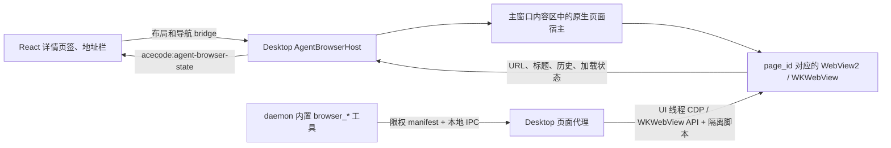

# Agent Browser（Windows / macOS Desktop）

ACECode Agent Browser 是一组由用户和 Agent 共享的可见浏览器页面。Windows
使用 WebView2；macOS 14+ 使用系统 WebKit 的 `WKWebView`。两个平台都为每个 Browser
页签创建独立页面，并让用户与 Agent 操作同一个可见页面。Agent 通过 Desktop 内部的
鉴权本地代理控制指定页面，不启动 Chrome/Chromium、不创建替代隐藏页，也不需要扩展、
外部调试端口、Safari Remote Inspector 或独立 host 进程。Linux 目前不启用该功能。



## 用户体验

- 在任务详情页签栏右上角每点击一次地球图标，都会创建并聚焦一个新的
  `新标签页`。网页加载后，页签标题随该页的 `document.title` 更新；页面声明的
  favicon 也只显示在对应 `page_id` 页签上，无图标或图标加载失败时回退到 Browser
  地球图标。后台页面更新标题或图标不会抢占当前页签。每页有独立 URL、DOM、历史
  记录和加载状态。
- 新页内容区由 React 显示极简 Browser welcome，不再向 WebView2 导航一张伪造的
  空白 HTML。输入地址后，原生 controller 在加载期间保持隐藏，只有成功加载的真实
  网页才会覆盖到该内容区。
- 地址栏支持 `http://`、`https://`、`about:blank`；裸域名自动补
  `https://`；无 scheme 且包含空格的文本使用 Bing 搜索。
- 后退、前进、刷新和网页本身的导航只作用于当前页签绑定的 WebView2 页面。
- 地址栏右侧的“与智能体共享”按页控制 Agent 是否可以经 Desktop 代理访问该页。用户
  手工创建的新页默认不共享；`browser_open` 创建的新页默认共享。关闭共享后，Agent
  对该页的 claim、选择、关闭和 CDP 命令都会以 `page_not_shared_with_agent` 拒绝。
- 地址栏后的操作区可以把网页元素或当前页控制台日志添加到聊天。元素选择使用网页内
  高亮，单击选取元素，`Esc` 取消；Windows 还支持拖拽选取共同祖先，并返回 HTML path
  与计算样式。macOS 首版返回 URL、标题、元素名/属性、outer HTML、尺寸和可见文本，
  暂不做跨 closed shadow root 或拖拽共同祖先选择。控制台附件是点击当时的当前页快照。
  两者只进入 composer 上方与 Pin/批注相同的可移除引用区，不会自动发送消息，也不会
  混入 composer 底部的能力/文件控制行。
- Windows 的“切换开发者工具”针对当前页调用 WebView2 Developer Tools。WebView2
  公开 API 只能打开或聚焦独立 DevTools 窗口，不能由宿主关闭已打开的窗口，因此关闭
  动作由该 DevTools 窗口自身完成。WKWebView 没有公开的宿主 Web Inspector API，macOS
  会返回明确的 unsupported 错误，不调用私有 selector。
- 网页内容区保留 WebView2 标准右键菜单（具体菜单项由 Runtime、页面元素和系统语言
  决定）；ACECode 主 UI 的自定义/屏蔽右键策略不会影响 Browser 页面。
- Browser 页签之间共享专用 Profile 的 Cookie/登录状态，行为与普通浏览器多个标签页
  一致；切换页签只显示对应 controller，关闭页签立即释放对应页面。
- 切换到文件/变更页签、关闭浏览器页签、隐藏窗口或打开 ACECode 模态框时，
  native 页面会隐藏，避免覆盖主 WebView UI。
- Agent 正在调用浏览器工具时，网页内容区出现与 VS Code Browser View 相同
  色序和节奏的彩虹边框；系统开启“减少动态效果”时使用静态渐变。
- 断网、域名解析、证书、超时等导航失败，以及页面无响应、渲染进程退出和 OOM，
  统一显示使用 ACECode 主题 token 的极简状态页。状态页保留尝试的地址，提供“重试”，
  有历史时提供“返回上一页”；WebView2/Chromium 自带错误文档始终保持隐藏。

浏览器 Profile 与 ACECode 主 UI、Edge/Safari Profile 隔离并持久化：Windows 位于
`<acecode-dir>/agent-browser/webview2`；macOS 把固定 data-store UUID 保存在
`<acecode-dir>/agent-browser/macos-profile-id`，实际网页数据由系统 WebKit 对应的
identifier data store 管理。在 Browser 页签中完成的登录会在 Desktop 重启后保留。

## Agent 工具

Windows 和 macOS Desktop 默认注册以下结构化工具：

- 生命周期和导航：`browser_open`、`browser_navigate`、`browser_close`
- 页面理解：`browser_read_page`、`browser_wait`、`browser_evaluate`
- 输入与交互：`browser_click`、`browser_fill`、`browser_type`、
  `browser_press`、`browser_hover`、`browser_drag`、`browser_scroll`
- 视觉和弹窗：`browser_screenshot`、`browser_handle_dialog`

macOS 的交互工具（click/fill/type/press/hover/drag/scroll）额外暴露
`input_mode: "synthetic" | "native"`，由 Agent 按页面需要显式选择：

- `synthetic` 是默认值。它在命名 `WKContentWorld` 中定位 DOM，并通过 focus、value
  setter、`HTMLElement.click()` 与合成事件完成操作；不需要系统权限，但事件的
  `isTrusted` 为 `false`。普通表单、链接和多数 Web 应用优先使用这一模式。
- `native` 使用 `CGEvent` 向当前可见且激活的 ACECode 页面发送真实鼠标、键盘、文本和
  滚轮事件，适用于明确拒绝 untrusted event 的页面。它要求“系统设置 > 隐私与安全性 >
  辅助功能”授权，执行时会把 ACECode 窗口置前，也可能与用户同时移动鼠标产生干扰。
- Agent 应先尝试 `synthetic`，只有站点明确拒绝、拖拽/快捷键必须依赖 trusted event，
  或用户明确要求真实输入时才选 `native`。原生权限不足时返回稳定的
  `native_input_permission_required`，不会静默降级或偷偷请求别的浏览器。
- macOS 交互结果会回报实际的 `input_mode` 和 `input_trust`；Windows 继续使用 WebView2
  CDP 的既有参数与返回结构，不新增这两个 schema 参数。

典型流程是：

1. `browser_open` 总是创建新的 Browser 页签并打开可选 URL，结果返回稳定
   `page_id`。
2. `browser_read_page` 获取 URL、标题、正文、viewport、revision 和带角色/名称的
   `@eN` 元素引用。
3. 把 `@eN` 与同一次读取返回的 `revision` 一起传给点击、填写、输入、悬停或
   拖拽工具；页面变化后重新读取。缺少 revision 或引用过期会明确失败，不会猜测。
4. 需要视觉证据时调用 `browser_screenshot`；输出 PNG 同时作为会话附件返回。
5. 后续工具省略 `page_id` 时会锁定工具开始时的活动页；需要明确操作某页时传入
   `browser_open` 返回的 `page_id`。用户在工具执行中切换页签不会改变该调用的目标。
6. `browser_close` 只关闭指定页（省略时关闭活动页）并同步移除对应详情页签，不会
   删除持久化 Profile，也不会影响其它 Browser 页面。

Browser 工具出现时，Web UI 会自动打开当前任务的 Browser 页签。加载已有会话
时，历史上已经完成的工具调用不会抢占当前页签。

## 运行时和安全边界

- Desktop 只创建本机 IPC；请求必须携带 manifest 中的随机令牌。Windows 使用随机命名
  管道，macOS 使用 `<acecode-dir>/run/agent-browser.sock`，socket 权限为 `0600`，并用
  `getpeereid` 拒绝非当前用户的 peer。两个平台都不开放远程调试 TCP 端口。
- 共享权限保存在每个 `page_id` 上，并在 Desktop 代理内执行，而不只是隐藏前端按钮。
  用户撤销共享后，已有 daemon client 也不能继续控制该页。
- Desktop 在独立 environment 与代理就绪后写
  `<acecode-dir>/run/agent-browser.json`。manifest 包含协议版本、Desktop pid、
  实例 id、专用 Profile 标识、本地 endpoint、随机令牌和就绪时间，并使用限权原子写入。
- daemon 校验协议、平台 endpoint、绝对 Profile 路径和 Desktop pid 存活状态。请求由
  Desktop 按 `page_id` 找到现有用户页面，再 dispatch 到 UI 线程；Windows 调用
  `CallDevToolsProtocolMethod`，macOS 映射到公开 WKWebView API 或命名 content world。
  一次工具调用首次选定页面后保持锁定，不会另建 target、误连其它浏览器或切页串页。
- Agent Browser 不注册 `aceDesktop_*` binding、host object 或 web-message
  handler。任意网页无法取得主 ACECode UI 的 daemon token、localStorage 或
  native bridge。
- 顶层地址只允许 HTTP(S) 与 `about:blank`；`file:`、`javascript:`、`data:`、
  `edge:`、`devtools:` 以及其他显式 scheme 会在 React 和 native 两层拒绝。
- `browser_evaluate` 能改变当前网页，因此仍应视为网页操作能力，而不是 ACECode
  本机代码执行能力。它没有主 UI 的特权上下文。
- 控制台按页保存最近 1000 条、每条最多 16 KiB，并在新的主文档导航时清空。Windows
  使用 WebView2 Runtime/Log 事件；macOS 使用只转发有界文本且不提供返回值或原生能力的
  console shim/message handler。页面加载错误不占用网页上方空间显示红色提示条。
- native 每页上报 `content_state`（`empty`、`loading`、`live`、
  `navigation_error`、`process_failed`）和稳定的 `failure_kind`。React 布局与 native
  controller 各自只在 `live` 时放行可见性，避免状态事件往返期间闪出内建错误页。
  GPU、utility、frame 等 WebView2 可自行恢复的辅助进程失败只进入控制台日志，不会
  替换仍可用的网页。
- native 在成功加载后以有界脚本读取文档 icon，只上报经过 HTTP(S)/data scheme 和大小
  校验的值。每次新导航清空旧 icon，generation 校验会丢弃上一文档迟到的异步结果。

## macOS 首版能力边界

- 只在 macOS 14+ 激活；更低系统版本、Linux 或没有完整 Desktop bridge 时前端不会把它
  视为可用 backend。
- `browser_screenshot` 使用 `takeSnapshotWithConfiguration`，当前返回可见 viewport 的
  PNG，不承诺 CDP `captureBeyondViewport` 的整页语义。
- 页面理解和 synthetic 输入依赖 DOM，可访问当前文档和同源 frame；跨源 iframe、浏览器
  原生弹层以及站点封闭的实现细节不保证可操作。遇到 trusted-event 检查可显式改用
  `native`，但 native 仍不能绕过网页权限、系统安全提示或不可见页面约束。
- JavaScript dialog 由 WKUIDelegate 接管并可用 `browser_handle_dialog` 响应；
  `target=_blank` 在发起页面内导航，不创建脱离 ACECode 管理的隐藏窗口。
- Web Content process 终止、导航失败和证书/网络错误会映射到稳定状态并隐藏 WKWebView；
  部分 WebKit 内部错误没有 WebView2/CDP 同等粒度，只能给出最接近的 `failure_kind`。

## 代码边界

- React 页签/工具栏：`web/src/components/AgentBrowserPanel.jsx`
- 浏览器聊天附件：`web/src/lib/agentBrowserChatContext.js`
- 页签生命周期：`web/src/lib/previewTabs.js`
- 活动态和 Desktop bridge：`web/src/lib/agentBrowser.js`
- welcome/加载/失败状态映射：`web/src/lib/agentBrowserSurface.js`
- 公共 native host API：`src/desktop/agent_browser_host.hpp`
- Windows WebView2 host：`src/desktop/agent_browser_host.cpp`
- macOS WKWebView host：`src/desktop/agent_browser_host_mac.mm`
- runtime manifest 与 URL policy：`src/desktop/agent_browser_runtime.{hpp,cpp}`
- 鉴权代理 client：`src/tool/agent_browser/cdp_client.{hpp,cpp}`
- 工具 schema/动作：`src/tool/agent_browser/browser_tools.{hpp,cpp}`

## 构建与验证

Windows 和 macOS 原生 smoke 都使用隔离的临时用户目录，不会覆盖正在运行的 Desktop
manifest 或 Agent Browser Profile。Windows：

```powershell
cmake --build build --config Release --target agent_browser_host_smoke
.\build\tests\Release\agent_browser_host_smoke.exe
```

成功输出包含 `SMOKE_OK`、两个不同 page id/URL/网页标题、favicon 同步、控制台采集、元素选择、
关闭一页后的剩余页数、截图尺寸、`native_widget_top: true`，以及
`acecode_bindings: 0`。

macOS 14+：

```bash
cmake -S . -B build/macos-agent-browser \
  -G Ninja -DACECODE_BUILD_DESKTOP=ON -DBUILD_TESTING=ON \
  -DCMAKE_TOOLCHAIN_FILE=<vcpkg-root>/scripts/buildsystems/vcpkg.cmake
cmake --build build/macos-agent-browser \
  --target acecode-desktop agent_browser_host_mac_smoke
build/macos-agent-browser/tests/agent_browser_host_mac_smoke.app/Contents/MacOS/agent_browser_host_mac_smoke
```

成功输出包含 `SMOKE_OK`、稳定 page id、`pages=2`、`synthetic=true` 和
`screenshot=true`；该测试创建两个真实 WKWebView，验证独立生命周期/单页关闭，并通过
鉴权 Unix socket 对指定页完成 JS 执行、synthetic 文本输入与 PNG 截图。native
`CGEvent` 需要当前用户授予辅助功能权限，因此不在无人值守 smoke 中自动触发，需在签名
Desktop app 内手工验证。

```powershell
pnpm --dir web test
pnpm --dir web build
cmake -S . -B build -DACECODE_BUILD_DESKTOP=ON -DBUILD_TESTING=ON `
  -DCMAKE_TOOLCHAIN_FILE=<vcpkg-root>/scripts/buildsystems/vcpkg.cmake
cmake --build build --config Release --target acecode acecode-desktop acecode_unit_tests
ctest --test-dir build -C Release --output-on-failure
```

手工验收至少覆盖：连续点击产生多个默认名为“新标签页”的独立 Browser 页签、逐页
网页标题/favicon 同步及缺失图标回退、地址栏/历史/刷新、网页标准右键菜单、
切换与单页/其它/右侧/全部关闭、窗口和详情栏 resize、DPI 切换、模态框遮挡、
登录态重启保留、Agent 自动激活且只有实际目标页显示彩虹状态、
逐页共享开关和撤销后的代理拒绝、元素/控制台引用卡片与 Pin/批注同区、Developer Tools、
`browser_read_page` 后真实点击/输入、截图附件，以及网页中
`typeof window.aceDesktop_agentBrowserGetState === "undefined"`。还要验证新标签页不显示
原生空白 WebView、导航失败不闪出 WebView2 错误文档、重试可恢复，以及模拟 OOM/
renderer failure 时显示对应 ACECode 状态并隐藏 controller。

## 常见故障

- “Open ACECode Desktop”：工具运行在 daemon，但没有兼容的 Windows Desktop 或
  macOS 14+ Desktop。
- “Agent Browser proxy is still starting”：native 页面环境或 Desktop 本地 endpoint
  正在初始化；工具会在有界时间内轮询，持续失败时检查 `[agent-browser]` 日志以及
  `<acecode-dir>/run/agent-browser.json`。macOS 还应确认 socket 路径没有超过系统 Unix
  socket 路径上限。
- `native_input_permission_required`：在 macOS 系统设置中授权 ACECode 的辅助功能权限，
  回到当前可见 Browser 页重试；若站点不要求 trusted event，也可改用 `synthetic`。
- `native_input_requires_visible_active_page`：先选中目标 Browser 页并确保窗口未最小化、
  未被 ACECode 模态层隐藏，再重试 native 输入。
- 页面引用过期：重新运行 `browser_read_page`，使用新 revision 和 `@eN`。
- 网页被 ACECode 弹窗盖住：native view 会主动隐藏；关闭弹窗后布局观察器会恢复。
- 地址栏和 Agent 截图正常但内容区纯白：检查窗口树中
  `ACECodeAgentBrowserWidget` 是否位于 `webview_widget` 上方；正常构建会在每次可见
  布局同步时重新钉住该 z-order。
