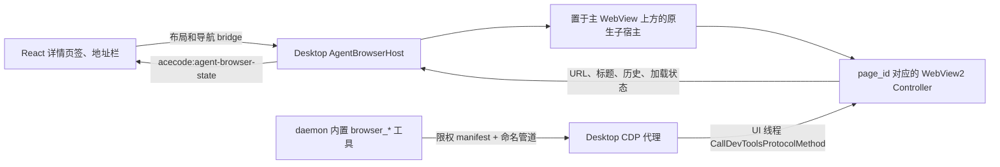

# Agent Browser（Windows Desktop）

ACECode Agent Browser 是一组由用户和 Agent 共享的可见浏览器页面。Windows
首版在共享的独立 WebView2 Environment 下为每个 Browser 页签创建一个 Controller；
这些 Controller 统一挂载到位于主 `webview_widget` 上方的专用原生子宿主，
Agent 通过 Desktop 内部的鉴权命名管道代理控制指定页面，不启动 Chrome、不创建替代隐藏页，也不需要
扩展、外部调试端口或独立 host 进程。



## 用户体验

- 在任务详情页签栏右上角每点击一次地球图标，都会创建并聚焦一个新的“浏览器”
  页签。每页有独立 URL、DOM、历史记录和加载状态。
- 地址栏支持 `http://`、`https://`、`about:blank`；裸域名自动补
  `https://`；无 scheme 且包含空格的文本使用 Bing 搜索。
- 后退、前进、刷新和网页本身的导航只作用于当前页签绑定的 WebView2 页面。
- Browser 页签之间共享专用 Profile 的 Cookie/登录状态，行为与普通浏览器多个标签页
  一致；切换页签只显示对应 controller，关闭页签立即释放对应页面。
- 切换到文件/变更页签、关闭浏览器页签、隐藏窗口或打开 ACECode 模态框时，
  native controller 会隐藏，避免覆盖主 WebView UI。
- Agent 正在调用浏览器工具时，网页内容区出现与 VS Code Browser View 相同
  色序和节奏的彩虹边框；系统开启“减少动态效果”时使用静态渐变。

浏览器 Profile 持久化在 `<acecode-dir>/agent-browser/webview2`。它不会复用
用户的 Edge Profile；在 Browser 页签中完成的登录会在 ACECode Desktop 重启后
保留，并继续由用户与 Agent 共享。

## Agent 工具

Windows 默认注册以下结构化工具：

- 生命周期和导航：`browser_open`、`browser_navigate`、`browser_close`
- 页面理解：`browser_read_page`、`browser_wait`、`browser_evaluate`
- 输入与交互：`browser_click`、`browser_fill`、`browser_type`、
  `browser_press`、`browser_hover`、`browser_drag`、`browser_scroll`
- 视觉和弹窗：`browser_screenshot`、`browser_handle_dialog`

典型流程是：

1. `browser_open` 总是创建新的 Browser 页签并打开可选 URL，结果返回稳定
   `page_id`。
2. `browser_read_page` 获取 URL、标题、正文、viewport、revision 和带角色/名称的
   `@eN` 元素引用。
3. 把 `@eN` 与同一次读取返回的 `revision` 一起传给点击、填写、输入、悬停或
   拖拽工具；页面变化后重新读取。缺少 revision 或引用过期会明确失败，不会猜测。
4. 需要视觉证据时调用 `browser_screenshot`；输出 PNG 同时作为会话附件返回。
5. 后续工具省略 `page_id` 时会锁定工具开始时的活动页；需要明确操作某页时传入
   `browser_open` 返回的 `page_id`。用户在工具执行中切换页签不会改变该调用的目标。
6. `browser_close` 只关闭指定页（省略时关闭活动页）并同步移除对应详情页签，不会
   删除持久化 Profile，也不会影响其它 Browser 页面。

Browser 工具出现时，Web UI 会自动打开当前任务的 Browser 页签。加载已有会话
时，历史上已经完成的工具调用不会抢占当前页签。

## 运行时和安全边界

- Desktop 在本机创建拒绝远程客户端的随机命名管道；请求必须携带 manifest 中的
  随机令牌。WebView2 不开放外部远程调试端口。
- Desktop 在独立 environment 与代理就绪后写
  `<acecode-dir>/run/agent-browser.json`。manifest 包含协议版本、Desktop pid、
  实例 id、专用 UDF、pipe name、随机令牌和就绪时间，并使用限权原子写入。
- daemon 校验协议、pipe 前缀、绝对 UDF 路径和 Desktop pid 存活状态；每个 CDP
  请求经命名管道送回 Desktop，由 Desktop 按 `page_id` 找到现有用户页面，再
  dispatch 到 WebView2 UI 线程并调用 `CallDevToolsProtocolMethod`。一次工具调用
  首次选定页面后保持锁定，因此不存在另建 target、误连其它浏览器或切页串页的路径。
- Agent Browser 不注册 `aceDesktop_*` binding、host object 或 web-message
  handler。任意网页无法取得主 ACECode UI 的 daemon token、localStorage 或
  native bridge。
- 顶层地址只允许 HTTP(S) 与 `about:blank`；`file:`、`javascript:`、`data:`、
  `edge:`、`devtools:` 以及其他显式 scheme 会在 React 和 native 两层拒绝。
- `browser_evaluate` 能改变当前网页，因此仍应视为网页操作能力，而不是 ACECode
  本机代码执行能力。它没有主 UI 的特权上下文。

## 代码边界

- React 页签/工具栏：`web/src/components/AgentBrowserPanel.jsx`
- 页签生命周期：`web/src/lib/previewTabs.js`
- 活动态和 Desktop bridge：`web/src/lib/agentBrowser.js`
- 原生 WebView2：`src/desktop/agent_browser_host.{hpp,cpp}`
- runtime manifest 与 URL policy：`src/desktop/agent_browser_runtime.{hpp,cpp}`
- 鉴权代理 client：`src/tool/agent_browser/cdp_client.{hpp,cpp}`
- 工具 schema/动作：`src/tool/agent_browser/browser_tools.{hpp,cpp}`

## 构建与验证

Windows 原生 Host/CDP 实机冒烟使用隔离的临时用户目录，不会覆盖正在运行的
Desktop manifest 或 Agent Browser Profile：

```powershell
cmake --build build --config Release --target agent_browser_host_smoke
.\build\tests\Release\agent_browser_host_smoke.exe
```

成功输出包含 `SMOKE_OK`、两个不同 page id/URL、关闭一页后的剩余页数、截图尺寸、
`native_widget_top: true`，以及 `acecode_bindings: 0`。

```powershell
pnpm --dir web test
pnpm --dir web build
cmake -S . -B build -DACECODE_BUILD_DESKTOP=ON -DBUILD_TESTING=ON `
  -DCMAKE_TOOLCHAIN_FILE=<vcpkg-root>/scripts/buildsystems/vcpkg.cmake
cmake --build build --config Release --target acecode acecode-desktop acecode_unit_tests
ctest --test-dir build -C Release --output-on-failure
```

手工验收至少覆盖：连续点击产生多个独立 Browser 页签、逐页地址栏/历史/刷新、
切换与单页/其它/右侧/全部关闭、窗口和详情栏 resize、DPI 切换、模态框遮挡、
登录态重启保留、Agent 自动激活且只有实际目标页显示彩虹状态、
`browser_read_page` 后真实点击/输入、截图附件，以及网页中
`typeof window.aceDesktop_agentBrowserGetState === "undefined"`。

## 常见故障

- “Open ACECode Desktop”：工具运行在 daemon，但没有兼容的 Windows Desktop。
- “Agent Browser proxy is still starting”：WebView2 或 Desktop 命名管道正在初始化；
  工具会在有界时间内轮询，持续失败时检查 WebView2 Runtime 和日志中的
  `[agent-browser]`。
- 页面引用过期：重新运行 `browser_read_page`，使用新 revision 和 `@eN`。
- 网页被 ACECode 弹窗盖住：native view 会主动隐藏；关闭弹窗后布局观察器会恢复。
- 地址栏和 Agent 截图正常但内容区纯白：检查窗口树中
  `ACECodeAgentBrowserWidget` 是否位于 `webview_widget` 上方；正常构建会在每次可见
  布局同步时重新钉住该 z-order。
