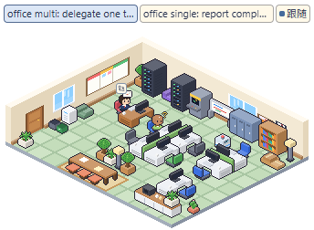

# 验证记录

## 导入基线

源工作区：`N:/Users/shao/acecode/.claude/worktrees/acecode-folder-structure-fd3342`，HEAD `8f83c048`，含原分支五个未提交文件的当前内容；原工作区未修改。

| 文件 | 源文件 SHA-256 |
| --- | --- |
| assets/desktop_pet/OFL.txt | 8ed5cd9e189e30dfdb0df2d5c2771556b50e9d502d899221328c3245caf8423c |
| assets/desktop_pet/agent_office_pet.html | fcb7b2fc7cef7857c89dedf5cfc10e86a2df26c86d4ca503dbcc5e5f1f585830 |
| src/apps/desktop/desktop_pet.cpp | 7d4b1567eb13ec3cd12ae0d173810f92ff21f663c843f62635a9b8e045409b67 |
| src/apps/desktop/desktop_pet.hpp | d606978e20a99f2b9243ca351b6acacc1334b586bc15a94b32d69cd7d1d19c01 |
| src/apps/desktop/desktop_pet_layout.cpp | 976a1d4ba4a3b0a5831b3473c82c1fa8db0a38d0e6b435d173d4d986722ccda3 |
| src/apps/desktop/desktop_pet_layout.hpp | a9f2ddd85a2dc39579c5c7f908f923de57b2e7f0b45c1bc3a312659226f7f74a |
| tests/desktop/desktop_pet_layout_test.cpp | 7141331b8342b4189452144a937f34b6799c1d348d7e56fd21b58ee33deefe57 |

## 验收

验收日期：2026-10-06，Windows x64，隔离工作区 `codex/agent-office-live`。

| 范围 | 结果与证据 |
| --- | --- |
| C++ 编译 | 当前工作区 Ninja/MSVC 构建 `acecode`、`acecode-desktop`、`acecode_unit_tests` 通过。为避开 vcpkg 旧下载 URL 的 404，只读复用原桌宠工作区已验证且清单依赖相同的 vcpkg 安装树和 webview 源码；可执行文件全部由当前源码生成，未复制其它工作区程序。 |
| C++ 测试 | 18 个 suite、193 项通过：新增桌宠布局、运行状态、最近消息、HTTP 快照测试，以及 EventDispatcher、全局会话目录/查询、恢复/回退/压缩、存储、回合结束/工具事件和注册表关停回归。 |
| 静态与规格 | 分层检查（含 parent include 限制）0 findings，所有权 strict/final 0 findings，OpenSpec strict 通过，git diff --check 通过。 |
| Web | `pnpm test` 全套通过；`pnpm build` 通过，4502 个正则字面量的兼容性扫描通过。 |
| 浏览器 | `node web/scripts/test-desktop-office.mjs` 22 项通过，无页面错误/外部网络请求；覆盖无演示启动、最近五个控件、鼠标/键盘、完成离座/睡眠、稳定外观/布局、共源图标、溢出列表动态更新、172/344/860 宽度、断线/空态。 |
| Windows 原生 | 用共享开发启动器及独立临时用户目录运行本次 Desktop，连接本机假 provider（没有真实模型调用）。原生 WebView2 的 12 项断言通过：重启恢复睡眠、主窗口跟随、真实星状主/子任务同时工作、成功子任务离座/主任务睡眠、上下文 1500/10000、手选关闭跟随/重开恢复、页面重载、滚轮放大/尺寸复位、办公室打开对应主会话。 |
| 原生几何与生命周期 | Win32 命中检查确认透明角落落到后方窗口，控制条与房间落到桌宠；空态/断线提示和成员面板共同回传可见区域，避免被房间多边形裁掉；系统移动循环通过键盘移动使 x 从 1014 变为 981，测试后复原；窗口样式保留 TOPMOST/NOACTIVATE，RGBA 截图透明角落 alpha=0。最后一次内嵌资源构建后，另用 Win32 WindowFromPoint 验证断线提示实际落在原生命中区域；通过原生 quitApp 正常退出并确认本次进程结束。 |
| 视觉审查 | 保留原作像素房间；独立 finish reviewer 初次仅发现展开成员列表滞后，修复及新增断言后复核 `resolved / ship`。唯一 detector 轮次中的最小 9px 功能文字已改为 11px，紧凑控制组重复间距经审查接受。 |

原生运行截图来自真实 daemon/agent 生命周期（本机测试 provider）：




定向 C++ 回归命令：

```text
acecode_unit_tests --gtest_filter=DesktopPetLayout.*:SessionActivityState.*:RecentFixture.*:DesktopOfficeHttp.*:EventDispatcher.*:EventDispatcherWait.*:GlobalSessionCatalog.*:GlobalSessionCatalogIndex.*:GlobalSessionSearchService.*:SessionManagerResume.*:SessionManagerRewind.*:SessionManagerCompactReplace.*:SessionStorage.*:AgentLoopTurnTiming.*:AgentLoopTermination.*:AgentLoopToolLifecycleEvents.*:AgentLoopCompactEvents.*:SessionRegistryShutdown.*
```

浏览器脚本通过 `ACE_PLAYWRIGHT_MODULE` 使用已安装的 Playwright，`ACE_BROWSER_CHANNEL=msedge`；`ACE_OFFICE_CAPTURE_DIR` 可指定截图目录。原生验收对两个 WebView2 使用进程级 `WEBVIEW2_ADDITIONAL_BROWSER_ARGUMENTS=--remote-debugging-port=0`，通过临时目录中的 DevToolsActivePort 连接；未修改用户全局环境或配置。

运行边界：本次验证 Windows Desktop；macOS/Linux 本次仅保留无桌宠的空实现，没有宣称跨平台原生验收。源代码交付不会自动替换用户已安装的 Desktop。
